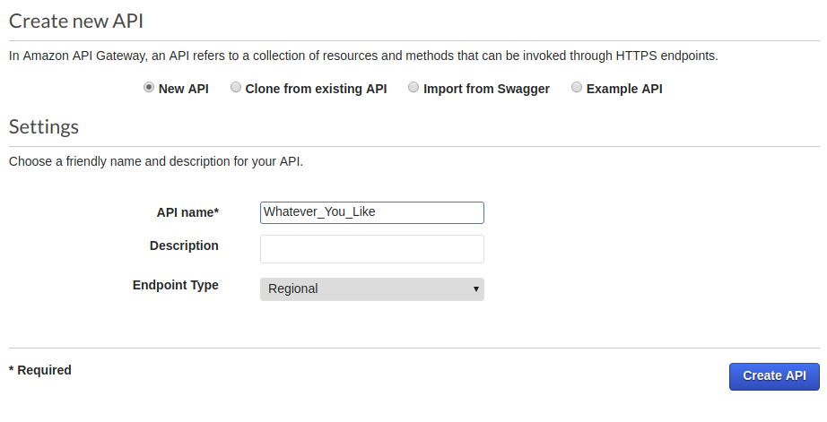
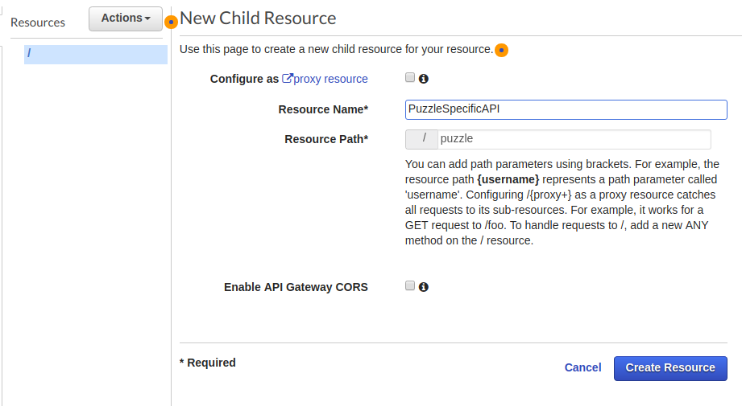
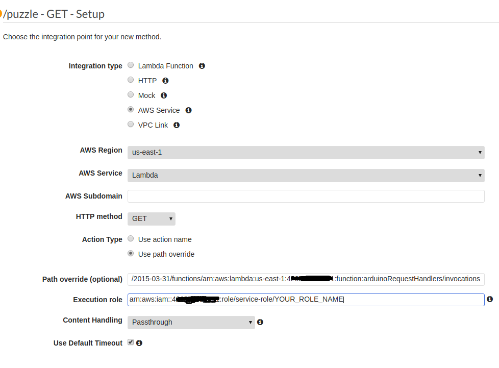
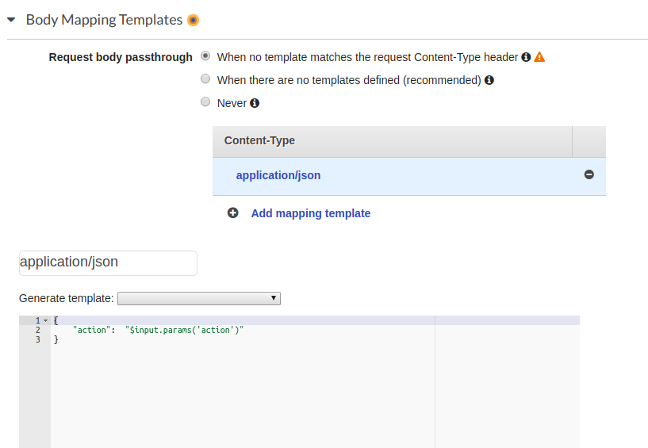
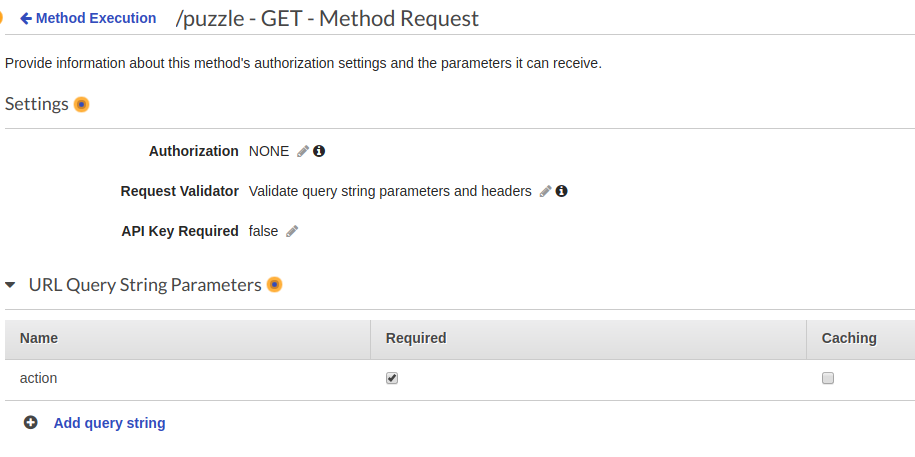
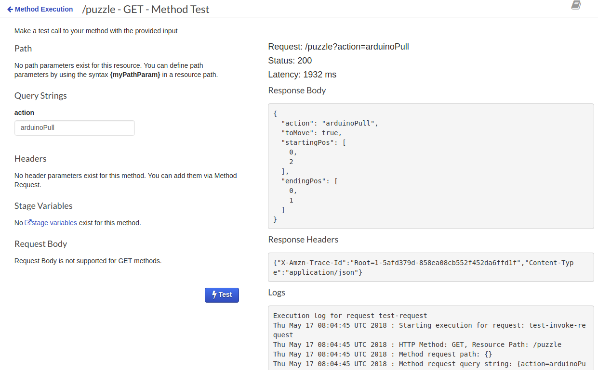

# Configure Amazon API Gateway

## Why
To trigger the execution of our [web server lambda function](./2-webserver-lambda-function.md) across an internet away, ( tiers of routers away...to be more exact :) ) we need an API that bridges an URL with the lambda functions, and forwarding all parameters attached. This is what Amazon API Gateway is used for in our system.

## How
-  Go to [Amazon API Gateway](https://console.aws.amazon.com/apigateway/home?region=us-east-1#/welcome), be consistent about your choice of region.
- Create a new API, specifying `API Name` with anything you like. (e.g. "slidingPuzzleMotion")

- **Strongly Recommend: read this [well-written tutorial](https://docs.aws.amazon.com/apigateway/latest/developerguide/integrating-api-with-aws-services-lambda.html)**
- In the `Action` drop down menu,
  - `Create Method` creates a RESTful HTTP method for that particular URL. ( e.g. create `GET` under /about will allow GET requests )
  - `Create Resource` creates one more level traverse down the URL. ( e.g. create career resource under /website.com/ will creates an addressable URL of /website.com/career/)
- In our case, we create a resource specific for `/puzzle` and `GET` method for the Arduino to pull Alexa Skill states.

- Fill in the Integration Request details as follows:

- Further add `application/json` into Body Mapping Templates, more importantly, specify the mapping from query string `action` to a field value under [`event` input parameters](https://github.com/AlexXiong97/alexa-skill-with-arduino-webclient/blob/master/src/arduinoRequestHandlers/lambda/index.js#L24).

- Last steps on Method Request, enabling a validity check on query string which are expected to provide the required parameters like `action`. Yay! You are ready for testing and deployment.

## Testing
Go to test with a thundering icon, and input any possible value for `action` field, which is equivalent to sending a GET request to `https://xxxx.execute-api.us-east-1.amazonaws.com/STAGE_NAME/puzzle?action=...` URL.

Your result should look like the following:

## Deployment
Go to `action` dropdown menu and choose `Deploy API`, you should see a dialog window prompted out asking for stages. By convention, just create a new stage of `prod`, standing for your production stage. Then off you go.

You could verify the successful deployment by typing the URL from your browser.

<a href="./2-webserver-lambda-function.md"></img></a>
<a href="./4-invoking-another-lambda.md"></img></a>
